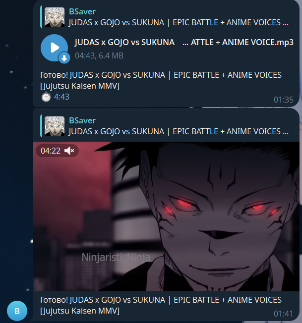

# BSaver — Telegram YouTube Downloader Bot

> ⚠️ **Внимание! Бот находится в активной разработке. Возможны баги, недоработки и неожиданные ошибки.**

Бот для скачивания видео и аудио с YouTube прямо в Telegram.  
Основан на [aiogram](https://github.com/aiogram/aiogram) и [yt-dlp](https://github.com/yt-dlp/yt-dlp).

## Возможности

- Скачивание видео с YouTube в выбранном качестве (144p–720p)
- Скачивание аудио в формате MP3
- Красивая карточка с выбором формата и размерами файлов

## Как запустить

1. **Клонируйте репозиторий:**
   ```bash
   git clone <repo-url>
   cd BSaver
   ```

2. **Установите зависимости:**
   ```bash
   pip install -r requirements.txt
   ```

3. **Создайте файл `.env`**  
   Пример содержимого:
   ```python
   BOT_TOKEN = "ваш_токен_бота"
   ```

4. **Запустите бота:**
   ```bash
   python main.py
   ```

## Использование

- Отправьте боту ссылку на YouTube-видео.
- Получите карточку с выбором качества и кнопками.
- Нажмите нужную кнопку — получите файл!

## Пример работы

### 1. Карточка с выбором качества и размерами файлов


### 2. Получение MP3 и видео



## Зависимости

- Python 3.10+
- aiogram
- yt-dlp
- ffmpeg (должен быть установлен в системе)

## Лицензия

MIT

---

### Планы на будущее

В будущем, возможно, бот будет поддерживать скачивание видео и аудио не только с YouTube, но и с других платформ:
- SoundCloud
- Instagram
- Spotify

Следите за обновлениями!
